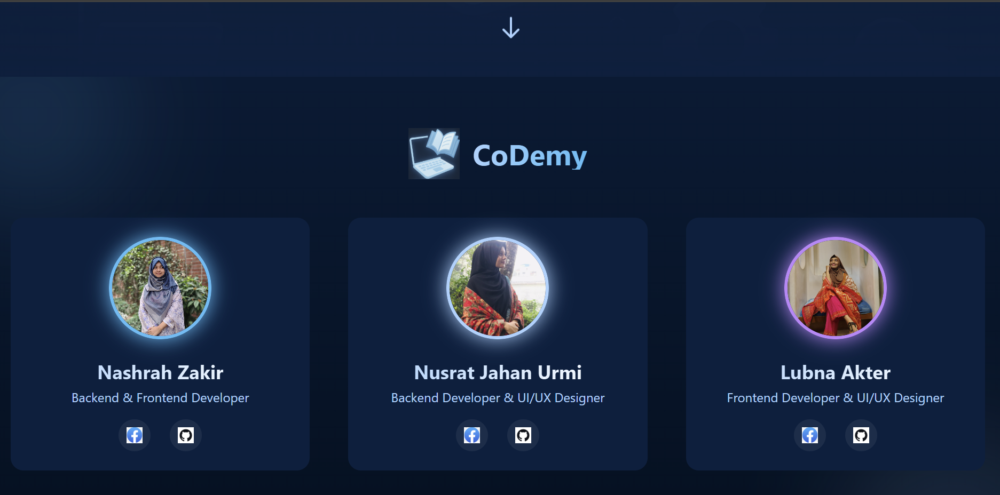
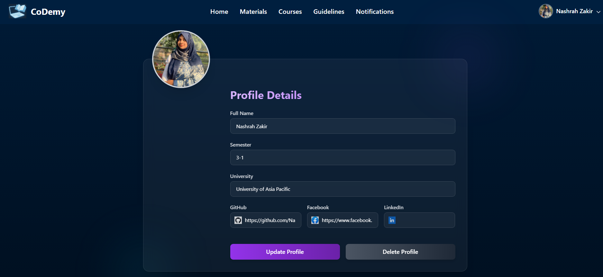
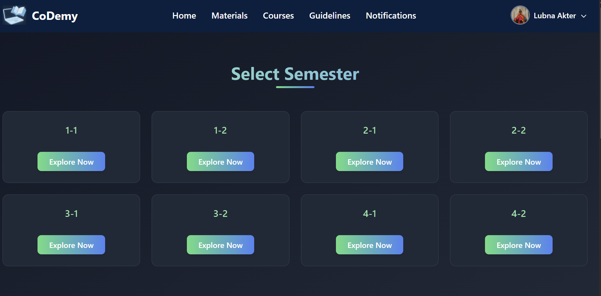
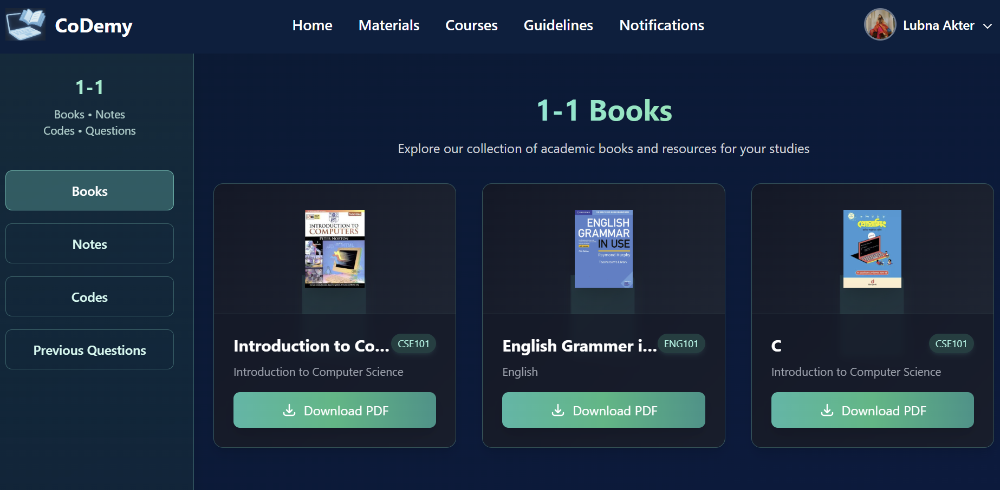
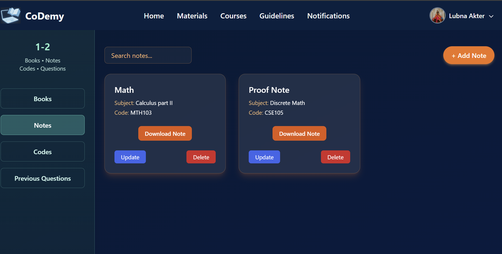
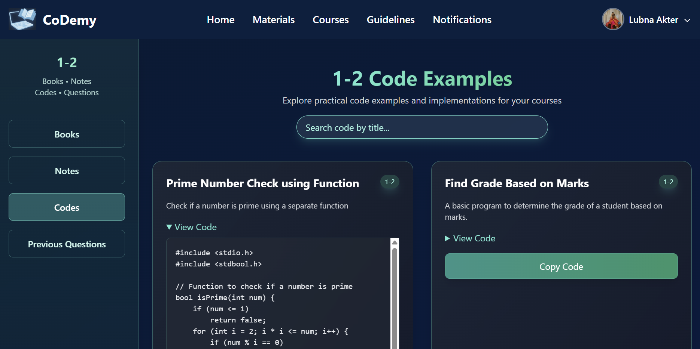
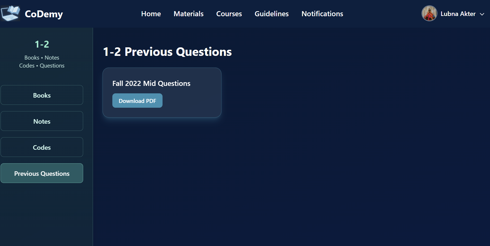
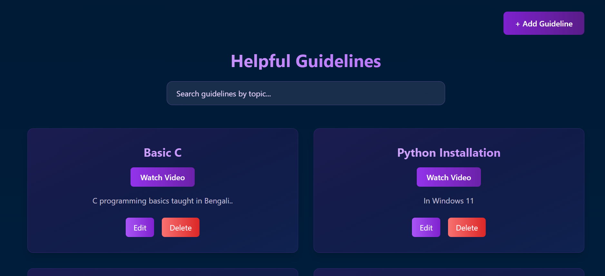
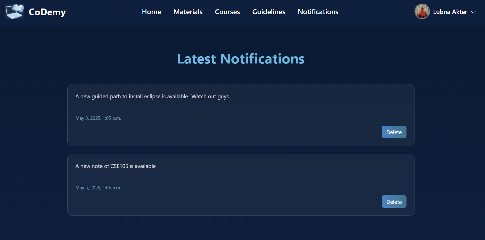

# 📚 CoDemy – CSE Academic Resource Hub
CoDemy is a Django-based web platform built for Computer Science & Engineering (CSE) students to access, share, and manage academic resources in a centralized and structured way.

## 🚀 Features

- 📘 **Semester-wise Materials**: Access and download books, class notes, codes, and previous questions.
- 🧑‍🎓 **User Accounts**: Register, login, update profiles, and manage uploads.
- 🔍 **Search & Filter**: Quickly find resources by subject, code, or semester.
- 🧠 **Course Info**: Discover relevant academic courses with details and registration links.
- 🎓 **Guideline Sharing**: View and upload technical tutorials and academic guidelines.
- 🔔 **Notifications**: Receive real-time updates about new uploads and announcements.
- 📂 **Clean UI**: TailwindCSS-powered responsive interface for smooth user experience.

## 🛠️ Built With

- **Backend**: Django (Python)
- **Frontend**: HTML, Tailwind CSS, JavaScript
- **Database**: SQLite3 (default Django DB)
- **Editor**: Visual Studio Code
- **Security**: Django authentication system, form validation

## 🖼️ Screenshots

>### 🔹 Landingpage

### 🔹 Homepage

### 🔹 Profile

### 🔹 Materials

### 🔹 Courses

### 🔹 Guidelines

### 🔹 Notifications

## 🧑‍💻 Local Setup

1. **Clone the repository**:
    git clone https://github.com/yourusername/codemy.git
    cd codemy

2. **Create and activate a virtual environment**:
    python -m venv venv
    # On Windows: venv\Scripts\activate

3. **Install dependencies**:
    pip install -r requirements.txt

4. **Run migrations**:
    python manage.py makemigrations
    python manage.py migrate

5. **Create superuser**:
    python manage.py createsuperuser

6. **Run the server**:
    python manage.py runserver
    Visit http://127.0.0.1:8000 in your browser.

👥 Team Members

    Nashrah Zakir – ID: 22201202

    Nusrat Jahan Urmi – ID: 22201214

    Lubna Akter – ID: 22201219

📌 Future Improvements

🔎 Advanced search filters and tags

📱 Mobile app version

🧑‍🏫 Faculty upload verification

🧠 AI-based content recommendation

💬 Discussion forums and feedback options

📄 License
This project is for academic use only. Contact the developers for reuse or contribution.

